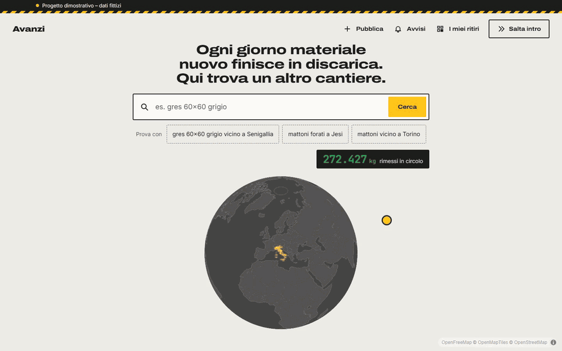

# Avanzi

[Italiano](README.md) · **English**

A demo project with fictional data: a local marketplace where builders and building-supply stores list
leftover new building materials, and anyone looking for them finds them on the map. All companies and people are made up.
The app itself is in Italian.

## The problem

When a job ends, pallets of new tiles, bricks, sanitaryware and windows are left over: ordered in excess, never installed.
Whoever has them doesn't know who to give them to, so they often sit in a warehouse or end up in landfill.
Whoever needs a few square metres for a bathroom or a garden wall doesn't know they exist, sometimes two kilometres away.
Avanzi ("leftovers") connects the two on a map, lot by lot, with pickup on site.

## My role

The idea, research, UX/UI, visual direction and product decisions are mine.
The code was written with Claude Code under my direction, checked on desktop and mobile at every step.

## Demo

[](docs/demo.mp4)

*The GIF plays at 2.25× speed: the [full video (mp4, 81 s)](docs/demo.mp4) runs at normal speed. Recorded with `npm run demo`.*

## Demo walkthrough

1. **Search in plain words.** On the globe, type "gres 60x60 grigio vicino a Senigallia" (grey 60x60 porcelain tiles near Senigallia) and press Enter.
2. **Look at the area.** The map flies to Senigallia: each lot is a yellow column, as tall as its weight, with the list alongside.
3. **Open a lot.** From the card you reach the lot page: photo, a 3D pallet you can rotate, a mini-map and similar lots.
4. **Book the pickup.** Pick a day and a time slot: you get a code with a QR, which you'll also find under "I miei ritiri" (My pickups).
5. **Get notified.** Search for something that isn't there and press "Avvisami quando arriva" (Notify me when it arrives).
6. **List your own leftovers.** "Pubblica" (Publish) takes five steps: the lot appears at the top of the list and the "kg back in circulation" counter goes up.
   If the lot matches a saved alert, the notification arrives right away, even in another window open on the demo.
7. **Try another city.** Search "mattoni vicino a Torino" (bricks near Turin) or type a region ("sicilia"): the map flies there
   and finds lots there too, with lot pages, booking and QR just like in Senigallia.

"Azzera i dati della demo" (Reset demo data), at the bottom of the alerts and pickups pages, brings everything back to the starting state.

## Technical choices

**Stack:** Vite, React, TypeScript, Tailwind CSS v4, MapLibre GL, three.js (@react-three/fiber).

- **From globe to flat map.** The map starts with a globe projection and switches to Mercator as you zoom in.
  On arrival it stays in pure Mercator, because that's the only way the 3D columns can be clicked.
- **3D columns by weight.** Square metres, pieces and pallets can't be compared with each other, so column height
  (80 to 350 m on the map) follows each lot's estimated weight.
- **three.js pallet loaded separately.** The 3D pallet (@react-three/fiber) is a separate bundle,
  downloaded only when a lot page is opened.
- **Data with a fixed seed.** Companies, lots and prices come from a script with a fixed seed: every run gives
  the same result, and adding a photo changes only the photos.
- **localStorage with reset.** Published lots, alerts and pickups live in the browser, with no server;
  one button clears them before a presentation.
- **Photos with srcset.** Every photo exists at 720 and 1200 px: cards take the smallest one that's enough,
  the lot page takes the 1200. WebP quality is chosen file by file.
- **All of Italy, generated on the fly.** The list of Italy's 7,896 municipalities (plus the hamlets around the demo area)
  is a separate ~135 KB compressed file, downloaded only when needed: on the first tap on the search box.
  Outside the Senigallia area, lots and companies are generated in the browser with the same generator
  and a seed taken from the town's name: same town, same lots, even from a direct link.
  Sites are placed towards the inland side, or next to nearby inhabited places for towns by the water.
- **Deferred map on mobile.** When results are opened on a phone, MapLibre starts only after the heading and list
  are visible.

## Design: "Clean building site"

Building-site colours: concrete as the background, asphalt for text and the globe, road-sign yellow for actions and lots.
Green appears only in the counters of kilograms saved from landfill.
Wide Archivo for headings, Inter for body text, JetBrains Mono for numbers, measurements and lot codes.
Each lot is a pallet label: code, large quantity and a dashed border.
Built for phones and for use in bright sunlight: high contrast, buttons at least 48 px, keyboard and reduced motion respected.

## Credits and licences

- **Map:** tiles by [OpenFreeMap](https://openfreemap.org), data © [OpenStreetMap contributors](https://www.openstreetmap.org/copyright), OpenMapTiles schema.
  Rendered with [MapLibre GL JS](https://maplibre.org).
- **Fonts:** Archivo, Inter and JetBrains Mono, SIL Open Font License 1.1, self-hosted
  (licence text in [public/fonts/OFL.txt](public/fonts/OFL.txt)).
- **Lot photos:** AI-generated (Kling). They don't show real materials, companies or places.
- **Italian municipalities:** coordinates and provinces from [GeoNames](https://www.geonames.org), licensed
  [CC BY 4.0](https://creativecommons.org/licenses/by/4.0/). Rebuild with `npm run comuni`.
- **Data:** companies, people, addresses and phone numbers are made up, including in towns generated on the fly.

## Author

Francesco Pierfederici · [LinkedIn](https://www.linkedin.com/in/francescopierfederici/)

© 2026 Francesco Pierfederici. All rights reserved.

## Getting started

```sh
npm install
npm run dev       # http://localhost:5173
npm run build     # production build in dist/
npm run preview   # serves the build at http://localhost:4173
```

Other scripts:

- `npm run photos` converts the photos in `assets/lotti` to WebP: 1200 px for the lot page, 720 px for the cards.
  The source photos (JPG) are not included in the repository: the ready-made WebP files in `public/lotti` are enough to run and deploy the site.
- `npm run data` regenerates the fictional data in `src/data` (fixed seed, always the same result).
- `npm run comuni` rebuilds `src/data/comuni-italia.txt` from GeoNames data (needs a network connection; downloads go to a temporary folder and are deleted).
- `npm run demo` records the demo video (with `npm run dev` running) and creates `docs/demo.mp4` and `docs/demo.gif`. Needs ffmpeg.
- `npm run test:parser` tests the search parser.

## Performance

Lighthouse scores on the production build (single run, simulated throttling):

| Page | Desktop | Mobile |
|---|---|---|
| Home | 99 | 63 |
| Results | 86 | 53 |
| Lot page | 99 | 87 |

**On mobile, the limit is the map.** Starting MapLibre (WebGL, vector style, 3D columns) keeps an average
phone's processor busy for a few seconds: that's what brings mobile results to around 50 and total blocking
time above 1.5 s. For people using the page the effect is softened:

- on mobile results, the map starts only after the heading and list are visible;
- MapLibre is loaded separately: the pickup and publish pages don't download it, and the lot page loads it only for the mini-map;
- cards use 720 px photos, and the 1200 is kept only for the main photo on the lot page, which needs to be sharp.

Going lower would mean giving up the map on the first screen, or replacing it with a static image until
it's touched: for this demo I chose to keep it.

These numbers come from headless Chrome with simulated throttling: on a real phone, measure with DevTools.
